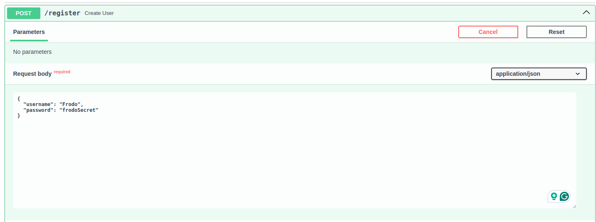
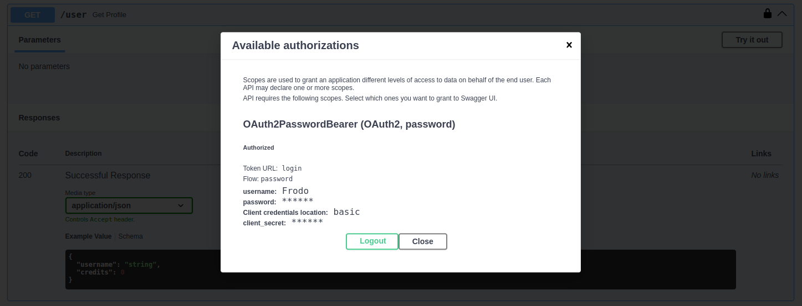
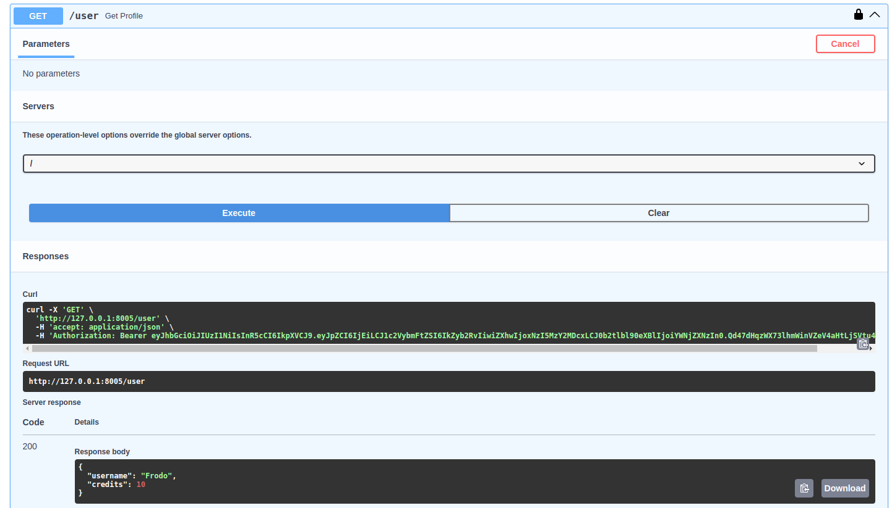
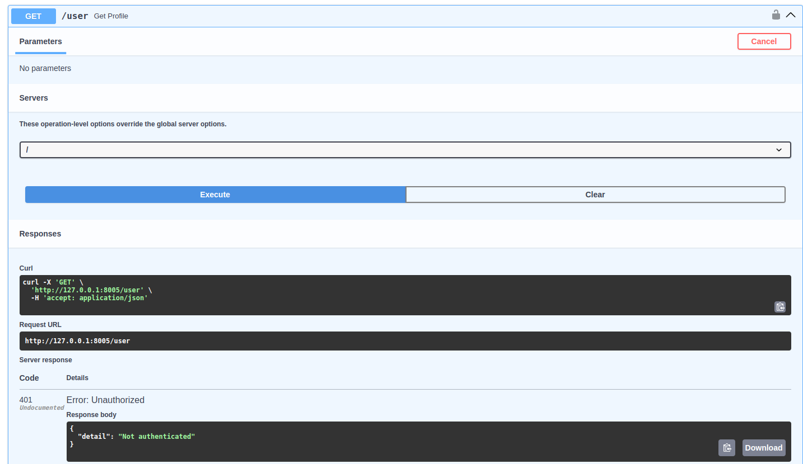
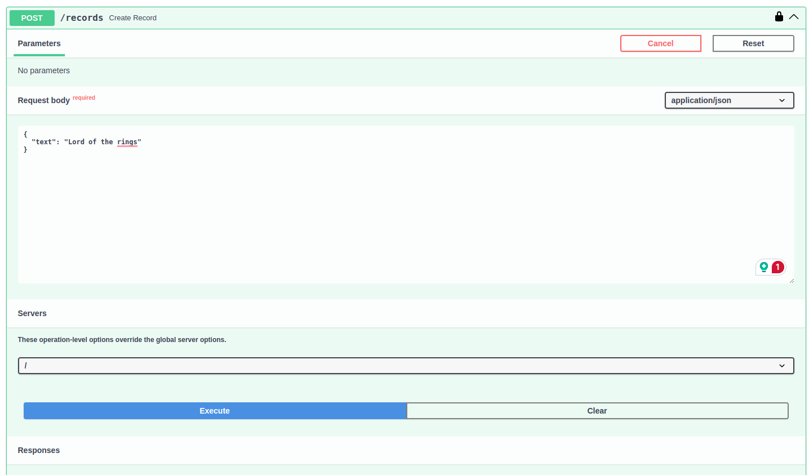
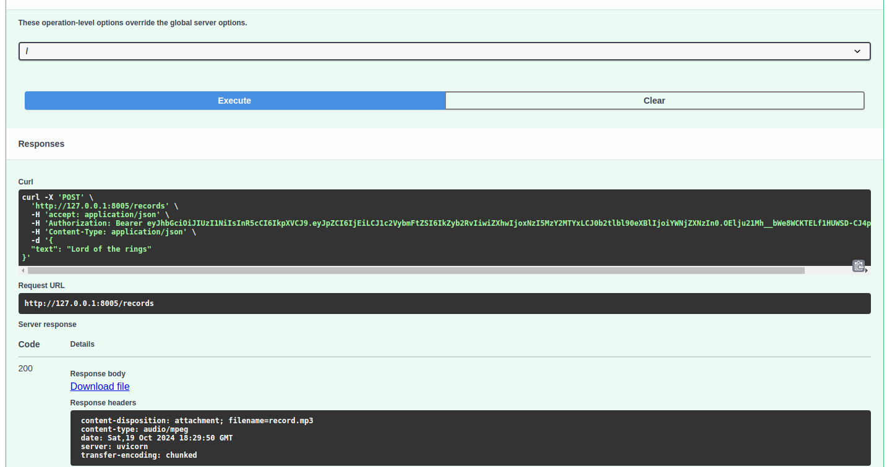
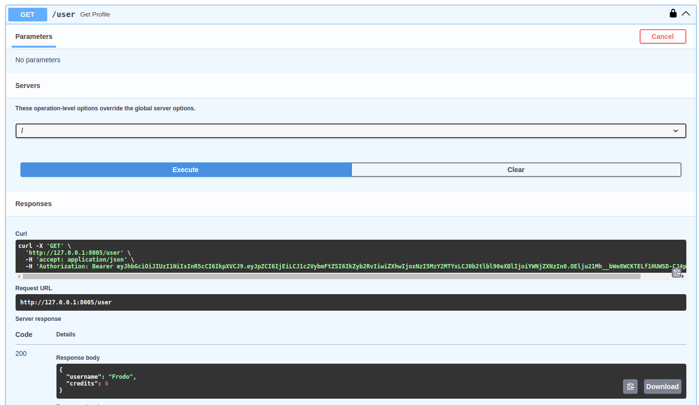
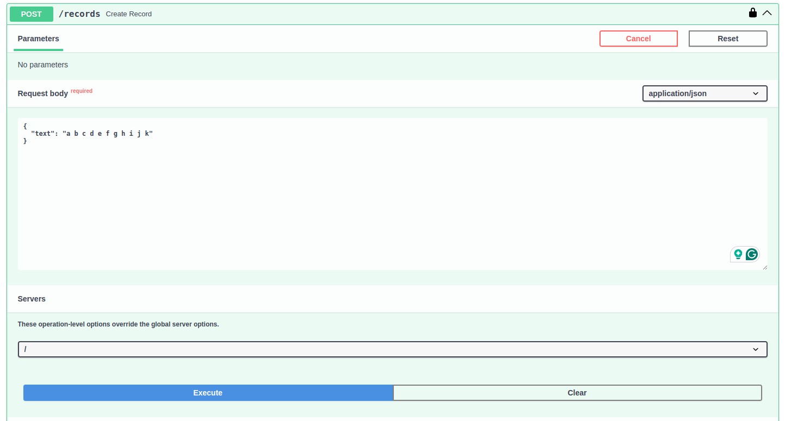
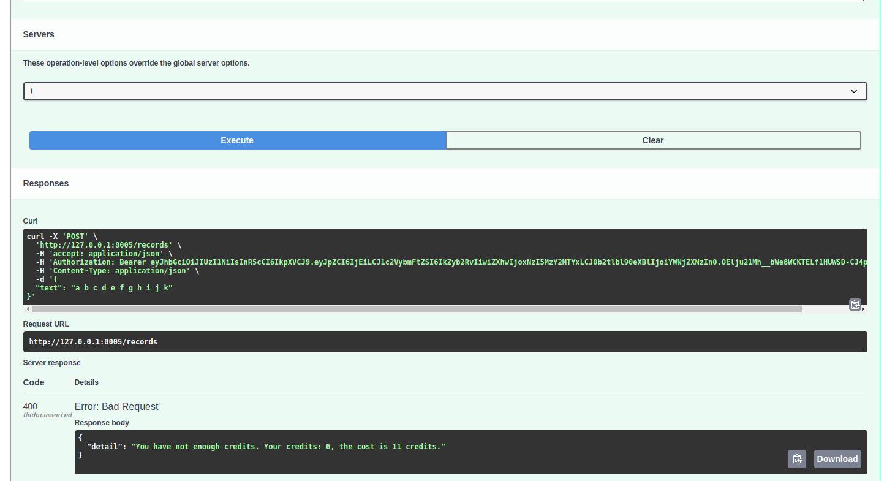

# voice-to-text-task
### Text to voice with FastApi.
## Setup
### Install
```sh
pip install -r requirements.txt
```
### Set .env
#### Add .env to voice-to-text-task folder and set variables (you can see an example here: .env_example).

## Code
### Black
```sh
black -l 120 --target-version py310 .
```
### Pylint
```sh
pylint .
```
### Tests
```sh
pytest
```

## Run
#### You can set another host or port if you want.
```sh
fastapi dev main.py --host 127.0.0.1 --port 8005
```
### Docs
#### http://127.0.0.1:8005/docs

### Docs
Registration


Authorizations


User profile


User profile - unauthorized


First text to voice, user profile



Second text to voice, user profile

# voice-to-text-task
